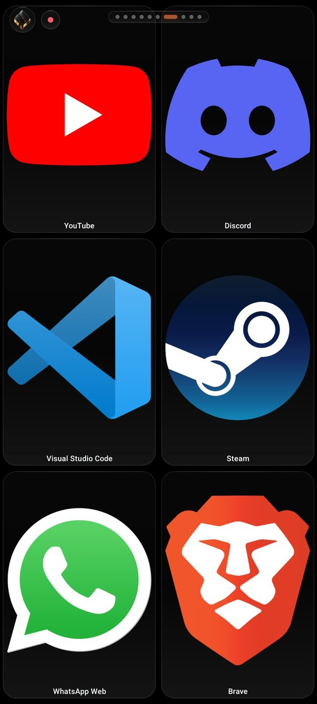
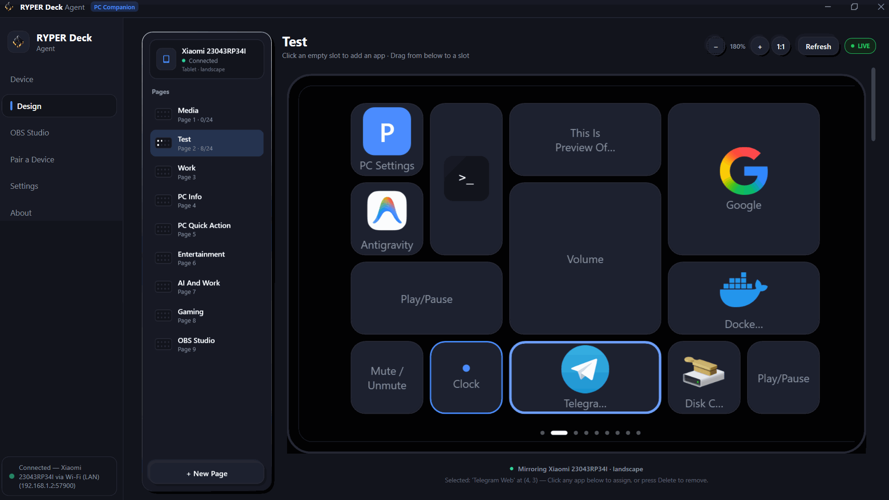

<div align="center">

  

  # RyperDeck

  ### Next-Gen Wireless Macro Deck for Windows with Liquid Glass UI
  **Turn your phone or tablet into an ultra-low latency macro controller. Free forever.**

  <br />

  [](https://react.dev/)
  [](https://www.typescriptlang.org/)
  [](https://vitejs.dev/)
  [](https://tailwindcss.com/)
  [](https://vercel.com/)
  [](LICENSE)
  [](CONTRIBUTING.md)

  <br />

  [🌐 Live Website](https://ryperdeck.vercel.app) • [✨ Key Features](#-key-features) • [📱 Interface Showcase](#-interface-showcase) • [⚡ Quick Start](#-quick-start) • [🔐 Environment Variables](#-environment-variables) • [🚀 Vercel Deployment](#-vercel-deployment) • [📄 License](#-license)

</div>

---

## 💡 About RyperDeck

Traditional stream decks and hardware macro controllers cost upwards of **$250** and lock you into a rigid physical grid of 15 buttons. 

**RyperDeck** turns any existing smartphone or tablet into a fully responsive, wireless Windows macro controller. Built with a bespoke **Liquid Glass** aesthetic, zero-latency local UDP networking, and infinite custom page switching, RyperDeck delivers complete control of your workstation without proprietary hardware.

- **Local UDP Protocol**: Sub-millisecond keystroke execution (`< 1ms` network response).
- **100% Private**: Zero cloud telemetry, no account required, no remote servers intercepting keystrokes.
- **Infinite Layouts**: Unlimited drag-and-drop pages for Streaming, Gaming, Video Editing, Coding, and AI Automations.
- **Built by One Person**: Designed and engineered by [Anurag](https://github.com/anuraaag23) (Age 20) with love for the creator community.

---

## 📱 Interface Showcase

<div align="center">
  
  <p><em>Ultra-fluid Liquid Glass mobile controller layout beside keyboard</em></p>
</div>

<br />

<div align="center">
  
  <p><em>Visual Windows companion configurator — drag, assign hotkeys, and deploy in real time</em></p>
</div>

---

## ✨ Key Features

| Feature | Description |
| :--- | :--- |
| **⚡ Sub-Millisecond Latency** | Direct UDP broadcast packets over your local Wi-Fi router. Keystrokes fire instantly without Bluetooth or internet lag. |
| **💎 Liquid Glass UI** | Optical caustics shader, dynamic ambient lighting, and backdrop refractions that look and feel tactile. |
| **📑 Limitless Pages & Presets** | Create separate workspaces for Discord, OBS, Premiere Pro, Blender, VS Code, and custom games. |
| **🔒 Complete Local Privacy** | Operates strictly within your private local network (LAN). No audio, video, or keystroke data ever leaves your computer. |
| **📦 Curated JSON Presets** | Ready-made profiles for Streamers, Gamers, Editors, and Power Users with one-click export/import. |
| **💬 Community Upvotes & Bugs** | Integrated feature request board and crash log uploader backed by Supabase and Google Drive. |
| **☕ Supporter Leaderboard** | Verified Razorpay tipping gateway honoring community backers on a live Hall of Fame leaderboard. |
| **📱 Mobile Responsive** | Tailored layout for smartphones and tablets with landscape orientation and safe-area optimization. |

---

## ⚖️ Stream Deck vs RyperDeck

| Metric | Physical Stream Deck | RyperDeck |
| :--- | :---: | :---: |
| **Hardware Cost** | **$150 – $250+** | **$0 (Free Forever)** |
| **Required Device** | Proprietary plastic hardware | Any phone or tablet you already own |
| **Available Keys** | Fixed 15 or 32 buttons | **Infinite pages & unlimited keys** |
| **Connection** | Heavy USB desktop cable | Wireless Local UDP (`< 1ms`) |
| **Portability** | Bulky desk tether | Pocket-sized, anywhere on Wi-Fi |
| **Telemetry / Tracking** | Proprietary telemetry | **0% Cloud Tracking / Telemetry** |
| **Display Quality** | Low-res membrane buttons | High-DPI OLED / AMOLED glass screen |

---

## 🛠️ Tech Stack

- **Framework**: [React 18](https://react.dev/) + [Vite 6](https://vitejs.dev/)
- **Language**: [TypeScript 5](https://www.typescriptlang.org/) (Strict Mode)
- **Styling**: [Tailwind CSS 3](https://tailwindcss.com/) with custom Liquid Glass caustic filters
- **Icons**: [Lucide React](https://lucide.dev/)
- **Backend / Database**: [Supabase](https://supabase.com/) (Feature Requests, Bug Reports, Supporter Wall)
- **Log Storage**: Google Apps Script Drive Proxy (Bug report screenshots & crash logs)
- **Payments**: Razorpay Standard Checkout SDK
- **Deployment & Hosting**: [Vercel](https://vercel.com/) with native edge rewrites and security headers

---

## ⚡ Quick Start

### Prerequisites
- [Node.js](https://nodejs.org/) (v18.0 or higher recommended)
- `npm` (v9+) or `pnpm` / `yarn`

### 1. Clone the repository
```bash
git clone https://github.com/anuraaag23/ryperdeck.git
cd ryperdeck
```

### 2. Install dependencies
```bash
npm install
```

### 3. Set up environment variables
Copy the sample environment file:
```bash
cp .env.example .env
```
*(See the [Environment Variables](#-environment-variables) section below for details. If you're only working on UI components, placeholder values work out of the box with local fallbacks).*

### 4. Run the development server
```bash
npm run dev
```
Open [http://localhost:5173](http://localhost:5173) in your browser to see the live application.

### 5. Build for production
```bash
npm run build
```
The compiled, minified bundle will be generated in the `dist/` folder.

---

## 🔐 Environment Variables

> [!IMPORTANT]
> **Security Notice**: Never commit `.env` or sensitive API keys to GitHub! The `.gitignore` is pre-configured to strictly ignore `.env`, `.env.local`, and all `.env.*.local` files. All production credentials must be configured securely in the **Vercel Project Dashboard**.

A reference template is provided in [`.env.example`](.env.example):

| Variable | Description | Where to Obtain / Notes |
| :--- | :--- | :--- |
| `VITE_SUPABASE_URL` | Your Supabase Project URL | Supabase Dashboard -> Project Settings -> API |
| `VITE_SUPABASE_ANON_KEY` | Public Anon Client Key | Supabase Dashboard -> Project Settings -> API |
| `VITE_GDRIVE_UPLOAD_URL` | Google Apps Script Web App URL | Deployed Apps Script Web App for log uploads |
| `VITE_RAZORPAY_KEY_ID` | Razorpay Key ID | Razorpay Dashboard -> API Keys (`rzp_live_...`) |
| `VITE_ADMIN_PASSWORD` | Passphrase for Admin Dashboard | Custom secret string used to unlock `/admin` |

---

## 🚀 Vercel Deployment

This project includes a production-ready [`vercel.json`](vercel.json) configured with SPA route rewrites, immutable asset caching, and security headers.

### Deploying to Vercel via Dashboard:
1. Push your repository to GitHub.
2. Go to [vercel.com/new](https://vercel.com/new) and import your `ryperdeck` repository.
3. Framework Preset will automatically detect **Vite**.
4. In **Environment Variables**, paste the keys from your `.env` file:
   - `VITE_SUPABASE_URL`
   - `VITE_SUPABASE_ANON_KEY`
   - `VITE_GDRIVE_UPLOAD_URL`
   - `VITE_RAZORPAY_KEY_ID`
   - `VITE_ADMIN_PASSWORD`
5. Click **Deploy**. Vercel will build and serve your site globally across edge networks in ~30 seconds.

---

## 🛡️ Built-in Admin Dashboard

RyperDeck features an integrated, protected administrative console for reviewing bug reports, moderating community feature requests, and monitoring support donations.

- Access route: `https://your-domain.app/#admin-ryper-2025`
- Features:
  - 🐛 **Bug Reports**: Inspect user crash logs, system specs, and attached Google Drive screenshots.
  - 💡 **Feature Management**: Add roadmap items, inline-edit titles/descriptions, toggle statuses (`requested`, `planned`, `building`, `done`), and adjust vote counts.
  - ☕ **Supporters Wall**: View contribution amounts, coffee counts, and verified ratings.
  - 📱 **Mobile Optimized**: Responsive controls designed for touchscreens and on-the-go management.

---

## 📂 Project Structure

```
ryperdeck/
├── public/                     # Static public assets
│   ├── creator/               # Creator photos & assets
│   ├── presets/               # Default JSON macro presets
│   ├── screenshots/           # High-res UI & showcase photos
│   ├── logo.png               # Brand icon & app logo
│   ├── robots.txt             # Search engine crawler policies
│   ├── sitemap.xml            # Canonical sitemap
│   └── _headers               # Hosting security headers
├── src/
│   ├── components/            # UI Components & Modules
│   │   ├── Coffee/            # Support modal, tipping widget & top supporters
│   │   ├── LiquidGlass/       # Optical caustics, shaders & cursor trail
│   │   ├── Presets/           # Default preset browser & downloads
│   │   ├── RequestFeature/    # Feature request & bug report modals
│   │   ├── Sections/          # Modular landing page sections
│   │   ├── AdminPage.tsx      # Protected administrative dashboard
│   │   ├── Footer.tsx         # Site footer & social links
│   │   └── Navbar.tsx         # Floating navigation pill with auto-hide
│   ├── config/                # App constants, presets & Razorpay config
│   ├── lib/                   # Supabase client, GDrive proxy & utilities
│   ├── App.tsx                # Main view router & state controller
│   ├── index.css              # Tailwind utilities, safe areas & custom classes
│   └── main.tsx               # React DOM bootstrap entry
├── .env.example               # Safe environment variables template
├── .gitignore                 # Strict ignores for node_modules, .env, and builds
├── vercel.json                # Vercel deployment rewrites & security headers
├── package.json               # Project manifest & dependencies
├── tsconfig.json              # TypeScript strict configuration
└── vite.config.ts             # Vite build & chunk configuration
```

---

## 🤝 Contributing

Contributions, issues, and feature requests are welcome! Feel free to check the [issues page](https://github.com/anuraaag23/ryperdeck/issues) or read the [Contributing Guidelines](CONTRIBUTING.md).

1. Fork the Project
2. Create your Feature Branch (`git checkout -b feature/AmazingFeature`)
3. Commit your Changes (`git commit -m 'feat: Add some AmazingFeature'`)
4. Push to the Branch (`git push origin feature/AmazingFeature`)
5. Open a Pull Request

---

## 👨‍💻 Author

**Anurag**
- Age: 20 • Solo Creator & Developer
- GitHub: [@anuraaag23](https://github.com/anuraaag23)
- Website: [ryperdeck.vercel.app](https://ryperdeck.vercel.app)
- Email: [anurag.ay8840@gmail.com](mailto:anurag.ay8840@gmail.com)

---

## 📄 License

This project is licensed under the MIT License — see the [LICENSE](LICENSE) file for details.

<div align="center">
  <sub>Built with care, precision, and zero investor pressure by a solo developer.</sub>
</div>
